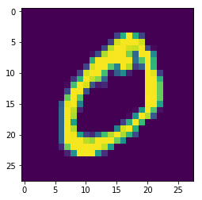
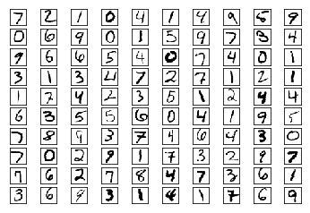
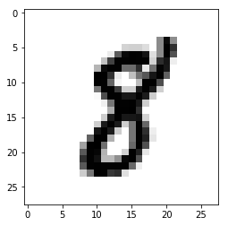

```python
from keras.datasets import mnist
import matplotlib.pyplot as plt

(x_train, _), (x_test, _) = mnist.load_data()

plt.imshow(x_train[1])

plt.show()
```

    /root/miniconda3/envs/carnd-term1/lib/python3.5/site-packages/h5py/__init__.py:34: FutureWarning: Conversion of the second argument of issubdtype from `float` to `np.floating` is deprecated. In future, it will be treated as `np.float64 == np.dtype(float).type`.
      from ._conv import register_converters as _register_converters
    Using TensorFlow backend.


    Downloading data from https://s3.amazonaws.com/img-datasets/mnist.npz
    11493376/11490434 [==============================] - 2s 0us/step





```python
### 1. Look at the big picture

# Given a 28x28 pixel image of a hand-written digit, classifiy the the digit
```


```python
### 2. Get the data

import numpy as np
import pandas as pd
import matplotlib
import matplotlib.pyplot as plt
%matplotlib inline
import tensorflow as tf
import keras
from keras.datasets import mnist
from keras.models import Sequential
from keras.layers import Dense, Dropout, Activation, Flatten
from keras.layers import Conv2D, MaxPooling2D
from keras.utils import np_utils
```


```python
# let's see what we're working with
print('Keras: ', keras.__version__, 'Tensoflow : ', tf.__version__)
```

    Keras:  2.1.3 Tensoflow :  1.5.0


```python
# index we'll use for visualizaitons
example_index = 41

# load up X & y nought
(X_train0, y_train0), (X_test0, y_test0) = mnist.load_data()

# we don't have to touch this or any step above again
```


```python
### 3. Discover and visualize the data to gain insights

X_train, y_train, X_test, y_test = X_train0, y_train0, X_test0, y_test0
```


```python
def plot100(images):
    fig = plt.figure()
    images = [image for image in images]
    for x in range(10):
        for y in range(10):
            ax = fig.add_subplot(10, 10, 1+10*y+x)
            ax.matshow(images[10*y+x], cmap = matplotlib.cm.binary)
            plt.xticks(np.array([]))
            plt.yticks(np.array([]))
    plt.show()

plot100(X_test0[:100])
```





```python
print(X_train.shape, X_test.shape)
```

    (60000, 28, 28) (10000, 28, 28)


```python
print(y_train[example_index])
```

    8


```python
plt.imshow(X_train0[example_index], cmap=plt.cm.gray_r, interpolation='nearest')
```


    <matplotlib.image.AxesImage at 0x7f7e4576f9e8>





```python
df = pd.DataFrame(X_train0[example_index][:, 6:24])
# pd.set_option('max_colwidth', 15)
df
```


<div>
<style>
    .dataframe thead tr:only-child th {
        text-align: right;
    }

    .dataframe thead th {
        text-align: left;
    }

    .dataframe tbody tr th {
        vertical-align: top;
    }
</style>
<table border="1" class="dataframe">
  <thead>
    <tr style="text-align: right;">
      <th></th>
      <th>0</th>
      <th>1</th>
      <th>2</th>
      <th>3</th>
      <th>4</th>
      <th>5</th>
      <th>6</th>
      <th>7</th>
      <th>8</th>
      <th>9</th>
      <th>10</th>
      <th>11</th>
      <th>12</th>
      <th>13</th>
      <th>14</th>
      <th>15</th>
      <th>16</th>
      <th>17</th>
    </tr>
  </thead>
  <tbody>
    <tr>
      <th>0</th>
      <td>0</td>
      <td>0</td>
      <td>0</td>
      <td>0</td>
      <td>0</td>
      <td>0</td>
      <td>0</td>
      <td>0</td>
      <td>0</td>
      <td>0</td>
      <td>0</td>
      <td>0</td>
      <td>0</td>
      <td>0</td>
      <td>0</td>
      <td>0</td>
      <td>0</td>
      <td>0</td>
    </tr>
    <tr>
      <th>1</th>
      <td>0</td>
      <td>0</td>
      <td>0</td>
      <td>0</td>
      <td>0</td>
      <td>0</td>
      <td>0</td>
      <td>0</td>
      <td>0</td>
      <td>0</td>
      <td>0</td>
      <td>0</td>
      <td>0</td>
      <td>0</td>
      <td>0</td>
      <td>0</td>
      <td>0</td>
      <td>0</td>
    </tr>
    <tr>
      <th>2</th>
      <td>0</td>
      <td>0</td>
      <td>0</td>
      <td>0</td>
      <td>0</td>
      <td>0</td>
      <td>0</td>
      <td>0</td>
      <td>0</td>
      <td>0</td>
      <td>0</td>
      <td>0</td>
      <td>0</td>
      <td>0</td>
      <td>0</td>
      <td>0</td>
      <td>0</td>
      <td>0</td>
    </tr>
    <tr>
      <th>3</th>
      <td>0</td>
      <td>0</td>
      <td>0</td>
      <td>0</td>
      <td>0</td>
      <td>0</td>
      <td>0</td>
      <td>0</td>
      <td>0</td>
      <td>0</td>
      <td>0</td>
      <td>0</td>
      <td>0</td>
      <td>0</td>
      <td>0</td>
      <td>0</td>
      <td>0</td>
      <td>0</td>
    </tr>
    <tr>
      <th>4</th>
      <td>0</td>
      <td>0</td>
      <td>0</td>
      <td>0</td>
      <td>0</td>
      <td>0</td>
      <td>0</td>
      <td>0</td>
      <td>0</td>
      <td>0</td>
      <td>0</td>
      <td>0</td>
      <td>0</td>
      <td>116</td>
      <td>244</td>
      <td>114</td>
      <td>0</td>
      <td>0</td>
    </tr>
    <tr>
      <th>5</th>
      <td>0</td>
      <td>0</td>
      <td>0</td>
      <td>0</td>
      <td>0</td>
      <td>0</td>
      <td>0</td>
      <td>0</td>
      <td>43</td>
      <td>47</td>
      <td>47</td>
      <td>34</td>
      <td>0</td>
      <td>116</td>
      <td>253</td>
      <td>206</td>
      <td>0</td>
      <td>0</td>
    </tr>
    <tr>
      <th>6</th>
      <td>0</td>
      <td>0</td>
      <td>0</td>
      <td>0</td>
      <td>0</td>
      <td>0</td>
      <td>19</td>
      <td>164</td>
      <td>246</td>
      <td>253</td>
      <td>252</td>
      <td>234</td>
      <td>33</td>
      <td>116</td>
      <td>253</td>
      <td>174</td>
      <td>0</td>
      <td>0</td>
    </tr>
    <tr>
      <th>7</th>
      <td>0</td>
      <td>0</td>
      <td>0</td>
      <td>0</td>
      <td>0</td>
      <td>60</td>
      <td>188</td>
      <td>252</td>
      <td>252</td>
      <td>253</td>
      <td>252</td>
      <td>252</td>
      <td>45</td>
      <td>210</td>
      <td>234</td>
      <td>17</td>
      <td>0</td>
      <td>0</td>
    </tr>
    <tr>
      <th>8</th>
      <td>0</td>
      <td>0</td>
      <td>0</td>
      <td>0</td>
      <td>74</td>
      <td>244</td>
      <td>252</td>
      <td>252</td>
      <td>147</td>
      <td>148</td>
      <td>210</td>
      <td>22</td>
      <td>140</td>
      <td>250</td>
      <td>230</td>
      <td>0</td>
      <td>0</td>
      <td>0</td>
    </tr>
    <tr>
      <th>9</th>
      <td>0</td>
      <td>0</td>
      <td>0</td>
      <td>0</td>
      <td>255</td>
      <td>253</td>
      <td>205</td>
      <td>21</td>
      <td>0</td>
      <td>64</td>
      <td>140</td>
      <td>169</td>
      <td>233</td>
      <td>253</td>
      <td>158</td>
      <td>0</td>
      <td>0</td>
      <td>0</td>
    </tr>
    <tr>
      <th>10</th>
      <td>0</td>
      <td>0</td>
      <td>0</td>
      <td>0</td>
      <td>253</td>
      <td>252</td>
      <td>154</td>
      <td>9</td>
      <td>0</td>
      <td>0</td>
      <td>68</td>
      <td>252</td>
      <td>252</td>
      <td>178</td>
      <td>0</td>
      <td>0</td>
      <td>0</td>
      <td>0</td>
    </tr>
    <tr>
      <th>11</th>
      <td>0</td>
      <td>0</td>
      <td>0</td>
      <td>0</td>
      <td>137</td>
      <td>252</td>
      <td>252</td>
      <td>196</td>
      <td>48</td>
      <td>49</td>
      <td>228</td>
      <td>252</td>
      <td>227</td>
      <td>48</td>
      <td>0</td>
      <td>0</td>
      <td>0</td>
      <td>0</td>
    </tr>
    <tr>
      <th>12</th>
      <td>0</td>
      <td>0</td>
      <td>0</td>
      <td>0</td>
      <td>5</td>
      <td>177</td>
      <td>252</td>
      <td>252</td>
      <td>232</td>
      <td>233</td>
      <td>252</td>
      <td>227</td>
      <td>50</td>
      <td>0</td>
      <td>0</td>
      <td>0</td>
      <td>0</td>
      <td>0</td>
    </tr>
    <tr>
      <th>13</th>
      <td>0</td>
      <td>0</td>
      <td>0</td>
      <td>0</td>
      <td>0</td>
      <td>15</td>
      <td>137</td>
      <td>252</td>
      <td>252</td>
      <td>253</td>
      <td>231</td>
      <td>48</td>
      <td>0</td>
      <td>0</td>
      <td>0</td>
      <td>0</td>
      <td>0</td>
      <td>0</td>
    </tr>
    <tr>
      <th>14</th>
      <td>0</td>
      <td>0</td>
      <td>0</td>
      <td>0</td>
      <td>0</td>
      <td>0</td>
      <td>81</td>
      <td>253</td>
      <td>253</td>
      <td>255</td>
      <td>207</td>
      <td>0</td>
      <td>0</td>
      <td>0</td>
      <td>0</td>
      <td>0</td>
      <td>0</td>
      <td>0</td>
    </tr>
    <tr>
      <th>15</th>
      <td>0</td>
      <td>0</td>
      <td>0</td>
      <td>0</td>
      <td>0</td>
      <td>51</td>
      <td>228</td>
      <td>252</td>
      <td>231</td>
      <td>232</td>
      <td>236</td>
      <td>44</td>
      <td>0</td>
      <td>0</td>
      <td>0</td>
      <td>0</td>
      <td>0</td>
      <td>0</td>
    </tr>
    <tr>
      <th>16</th>
      <td>0</td>
      <td>0</td>
      <td>0</td>
      <td>0</td>
      <td>49</td>
      <td>228</td>
      <td>252</td>
      <td>227</td>
      <td>48</td>
      <td>138</td>
      <td>252</td>
      <td>152</td>
      <td>0</td>
      <td>0</td>
      <td>0</td>
      <td>0</td>
      <td>0</td>
      <td>0</td>
    </tr>
    <tr>
      <th>17</th>
      <td>0</td>
      <td>0</td>
      <td>0</td>
      <td>0</td>
      <td>233</td>
      <td>252</td>
      <td>227</td>
      <td>50</td>
      <td>0</td>
      <td>138</td>
      <td>252</td>
      <td>208</td>
      <td>17</td>
      <td>0</td>
      <td>0</td>
      <td>0</td>
      <td>0</td>
      <td>0</td>
    </tr>
    <tr>
      <th>18</th>
      <td>0</td>
      <td>0</td>
      <td>0</td>
      <td>158</td>
      <td>253</td>
      <td>252</td>
      <td>79</td>
      <td>0</td>
      <td>0</td>
      <td>138</td>
      <td>252</td>
      <td>221</td>
      <td>25</td>
      <td>0</td>
      <td>0</td>
      <td>0</td>
      <td>0</td>
      <td>0</td>
    </tr>
    <tr>
      <th>19</th>
      <td>0</td>
      <td>0</td>
      <td>93</td>
      <td>253</td>
      <td>255</td>
      <td>144</td>
      <td>0</td>
      <td>0</td>
      <td>0</td>
      <td>149</td>
      <td>253</td>
      <td>173</td>
      <td>0</td>
      <td>0</td>
      <td>0</td>
      <td>0</td>
      <td>0</td>
      <td>0</td>
    </tr>
    <tr>
      <th>20</th>
      <td>0</td>
      <td>0</td>
      <td>166</td>
      <td>252</td>
      <td>249</td>
      <td>75</td>
      <td>0</td>
      <td>0</td>
      <td>43</td>
      <td>253</td>
      <td>223</td>
      <td>25</td>
      <td>0</td>
      <td>0</td>
      <td>0</td>
      <td>0</td>
      <td>0</td>
      <td>0</td>
    </tr>
    <tr>
      <th>21</th>
      <td>0</td>
      <td>0</td>
      <td>207</td>
      <td>252</td>
      <td>237</td>
      <td>70</td>
      <td>70</td>
      <td>112</td>
      <td>246</td>
      <td>253</td>
      <td>174</td>
      <td>0</td>
      <td>0</td>
      <td>0</td>
      <td>0</td>
      <td>0</td>
      <td>0</td>
      <td>0</td>
    </tr>
    <tr>
      <th>22</th>
      <td>0</td>
      <td>0</td>
      <td>165</td>
      <td>252</td>
      <td>253</td>
      <td>252</td>
      <td>252</td>
      <td>252</td>
      <td>252</td>
      <td>150</td>
      <td>17</td>
      <td>0</td>
      <td>0</td>
      <td>0</td>
      <td>0</td>
      <td>0</td>
      <td>0</td>
      <td>0</td>
    </tr>
    <tr>
      <th>23</th>
      <td>0</td>
      <td>0</td>
      <td>51</td>
      <td>137</td>
      <td>253</td>
      <td>252</td>
      <td>200</td>
      <td>210</td>
      <td>32</td>
      <td>0</td>
      <td>0</td>
      <td>0</td>
      <td>0</td>
      <td>0</td>
      <td>0</td>
      <td>0</td>
      <td>0</td>
      <td>0</td>
    </tr>
    <tr>
      <th>24</th>
      <td>0</td>
      <td>0</td>
      <td>0</td>
      <td>0</td>
      <td>0</td>
      <td>0</td>
      <td>0</td>
      <td>0</td>
      <td>0</td>
      <td>0</td>
      <td>0</td>
      <td>0</td>
      <td>0</td>
      <td>0</td>
      <td>0</td>
      <td>0</td>
      <td>0</td>
      <td>0</td>
    </tr>
    <tr>
      <th>25</th>
      <td>0</td>
      <td>0</td>
      <td>0</td>
      <td>0</td>
      <td>0</td>
      <td>0</td>
      <td>0</td>
      <td>0</td>
      <td>0</td>
      <td>0</td>
      <td>0</td>
      <td>0</td>
      <td>0</td>
      <td>0</td>
      <td>0</td>
      <td>0</td>
      <td>0</td>
      <td>0</td>
    </tr>
    <tr>
      <th>26</th>
      <td>0</td>
      <td>0</td>
      <td>0</td>
      <td>0</td>
      <td>0</td>
      <td>0</td>
      <td>0</td>
      <td>0</td>
      <td>0</td>
      <td>0</td>
      <td>0</td>
      <td>0</td>
      <td>0</td>
      <td>0</td>
      <td>0</td>
      <td>0</td>
      <td>0</td>
      <td>0</td>
    </tr>
    <tr>
      <th>27</th>
      <td>0</td>
      <td>0</td>
      <td>0</td>
      <td>0</td>
      <td>0</td>
      <td>0</td>
      <td>0</td>
      <td>0</td>
      <td>0</td>
      <td>0</td>
      <td>0</td>
      <td>0</td>
      <td>0</td>
      <td>0</td>
      <td>0</td>
      <td>0</td>
      <td>0</td>
      <td>0</td>
    </tr>
  </tbody>
</table>
</div>


```python
### 4. Prepare the data for Machine Learning algorithms

# reshape for TF (batch, height, width, channels)
X_train = X_train.reshape(X_train.shape[0], 28, 28, 1)
X_test = X_test.reshape(X_test.shape[0], 28, 28, 1)

X_train = X_train.astype('float32')
X_test = X_test.astype('float32')
```


```python
# normalize
X_train/=255
X_test/=255
```


```python
print(X_train.shape)
```

    (60000, 28, 28, 1)


```python
# one-hot encode
number_of_classes = 10

y_train = np_utils.to_categorical(y_train, number_of_classes)
y_test = np_utils.to_categorical(y_test, number_of_classes)
```


```python
print(y_train0[example_index], y_train[example_index])
```

    8 [0. 0. 0. 0. 0. 0. 0. 0. 1. 0.]


```python
### 5. Select a model and train it

# bad model
bad = Sequential()
bad.add(Flatten(input_shape=(28,28)))
bad.add(Dense(10, activation='softmax'))
bad.compile(loss='mean_squared_error',
              optimizer='sgd',
              metrics=['accuracy'])
bad.fit(X_train0, y_train, epochs=1)
```

    Epoch 1/1
    60000/60000 [==============================] - 3s 48us/step - loss: 0.1327 - acc: 0.3329


    <keras.callbacks.History at 0x7f7e4587ec18>


```python
bad.evaluate(X_test0, y_test)[0]
```

    10000/10000 [==============================] - 0s 41us/step


    0.11570980497598649


```python
# LeNet
# INPUT => CONV => RELU => POOL => CONV => RELU => POOL => FC => RELU => FC

model = Sequential()
model.add(Conv2D(32, kernel_size=(3, 3),
                 activation='relu',
                 input_shape=(28,28,1)))
model.add(MaxPooling2D(pool_size=(2, 2)))
model.add(Conv2D(64, (3, 3), activation='relu'))
model.add(MaxPooling2D(pool_size=(2, 2)))
model.add(Dropout(0.25))
model.add(Flatten())
model.add(Dense(128, activation='relu'))
model.add(Dropout(0.5))
model.add(Dense(10, activation='softmax'))
```


```python
model.summary()
```

    _________________________________________________________________
    Layer (type)                 Output Shape              Param #   
    =================================================================
    conv2d_1 (Conv2D)            (None, 26, 26, 32)        320       
    _________________________________________________________________
    max_pooling2d_1 (MaxPooling2 (None, 13, 13, 32)        0         
    _________________________________________________________________
    conv2d_2 (Conv2D)            (None, 11, 11, 64)        18496     
    _________________________________________________________________
    max_pooling2d_2 (MaxPooling2 (None, 5, 5, 64)          0         
    _________________________________________________________________
    dropout_1 (Dropout)          (None, 5, 5, 64)          0         
    _________________________________________________________________
    flatten_2 (Flatten)          (None, 1600)              0         
    _________________________________________________________________
    dense_2 (Dense)              (None, 128)               204928    
    _________________________________________________________________
    dropout_2 (Dropout)          (None, 128)               0         
    _________________________________________________________________
    dense_3 (Dense)              (None, 10)                1290      
    =================================================================
    Total params: 225,034
    Trainable params: 225,034
    Non-trainable params: 0
    _________________________________________________________________


```python
model.compile(loss='categorical_crossentropy',
              optimizer='sgd',
              metrics=['accuracy'])
```


```python
model.fit(X_train,
          y_train,
          batch_size=128,
          epochs=5,
          verbose=1,
          validation_data=(X_test, y_test))
```

    Train on 60000 samples, validate on 10000 samples
    Epoch 1/5
    60000/60000 [==============================] - 80s 1ms/step - loss: 1.7210 - acc: 0.4238 - val_loss: 0.6092 - val_acc: 0.8555
    Epoch 2/5
    60000/60000 [==============================] - 80s 1ms/step - loss: 0.7029 - acc: 0.7732 - val_loss: 0.3132 - val_acc: 0.9171
    Epoch 3/5
    60000/60000 [==============================] - 76s 1ms/step - loss: 0.4620 - acc: 0.8560 - val_loss: 0.2211 - val_acc: 0.9363
    Epoch 4/5
    60000/60000 [==============================] - 71s 1ms/step - loss: 0.3623 - acc: 0.8888 - val_loss: 0.1757 - val_acc: 0.9489
    Epoch 5/5
    60000/60000 [==============================] - 82s 1ms/step - loss: 0.3055 - acc: 0.9070 - val_loss: 0.1471 - val_acc: 0.9563


    <keras.callbacks.History at 0x7f7e32bac1d0>


```python
score = model.evaluate(X_test, y_test)
print("\nTest accuracy: ", score[1])
```

    10000/10000 [==============================] - 5s 459us/step
    
    Test accuracy:  0.9563


```python
### 6. Fine-tune your model

model.save('./mnist_keras_lenet.h5')
```


```python
### 7. Present your solution


class LeNetMnistClassifier():
    @staticmethod
    def toDigit(hot_encode):
        return np.argmax(hot_encode)
        
    def __init__(self, model_path=''):
        if model_path:
            from keras.models import load_model
            self.model_path = model_path
            self.model = load_model(model_path)
        else:
            self.model = self._model()
    
    def _model(self):
        model = Sequential()
        model.add(Conv2D(32, kernel_size=(3, 3),
                 activation='relu',
                 input_shape=(28,28,1)))
        model.add(MaxPooling2D(pool_size=(2, 2)))
        model.add(Conv2D(64, (3, 3), activation='relu'))
        model.add(MaxPooling2D(pool_size=(2, 2)))
        model.add(Dropout(0.25))
        model.add(Flatten())
        model.add(Dense(128, activation='relu'))
        model.add(Dropout(0.5))
        model.add(Dense(10, activation='softmax'))
        
        return model
    
    def predict(self, digits=()):
        return self.model.predict(digits)
    
    def evaluate(self, X_test=None, y_test=None):
        return self.model.evaluate(X_test, y_test)
    
    def preprocess_and_train(self, X_train=None, y_train=None, X_test=None, y_test=None):
        self._train(*self._preprocess(X_train, y_train, X_test, y_test))
        
    def _preprocess(self, X_train, y_train, X_test, y_test):
        X_train = X_train.reshape(X_train.shape[0], 28, 28, 1)
        X_test = X_test.reshape(X_test.shape[0], 28, 28, 1)

        X_train = X_train.astype('float32')
        X_test = X_test.astype('float32')
        
        X_train/=255
        X_test/=255
        
        number_of_classes = 10
        y_train = np_utils.to_categorical(y_train, number_of_classes)
        y_test = np_utils.to_categorical(y_test, number_of_classes)
        
        return X_train, y_train, X_test, y_test
    
    def _train(self, X_train, y_train, X_test, y_test):
        self.model.compile(loss='categorical_crossentropy',
              optimizer='sgd',
              metrics=['accuracy'])
        
        self.model.fit(X_train,
                        y_train,
                        batch_size=128,
                        epochs=1,
                        verbose=1,
                        validation_data=(X_test, y_test))
        
        import time
        timestr = time.strftime("%Y%m%d-%H%M%S")
        self.model.save("lenet_mnist_{0}.h5".format(timestr))
```


```python
### 8. Launch, moniter, and maintain your system

# train a new classifier
lenet = LeNetMnistClassifier()
lenet.preprocess_and_train(X_train=X_train0, y_train=y_train0, X_test=X_test0, y_test=y_test0)
```

    Train on 60000 samples, validate on 10000 samples
    Epoch 1/1
    60000/60000 [==============================] - 70s 1ms/step - loss: 1.7578 - acc: 0.4039 - val_loss: 0.6107 - val_acc: 0.8665


```python
# load a previous classifier & predict
classifier = LeNetMnistClassifier(model_path='./mnist_keras_lenet.h5')
prediction = classifier.predict(digits=np.array([X_train[41]]))

print(np.rint(prediction[0]), '===', y_train[example_index])
print(LeNetMnistClassifier.toDigit(prediction[0]), '===',LeNetMnistClassifier.toDigit(y_train[example_index]))
```

    [0. 0. 0. 0. 0. 0. 0. 0. 1. 0.] === [0. 0. 0. 0. 0. 0. 0. 0. 1. 0.]
    8 === 8

